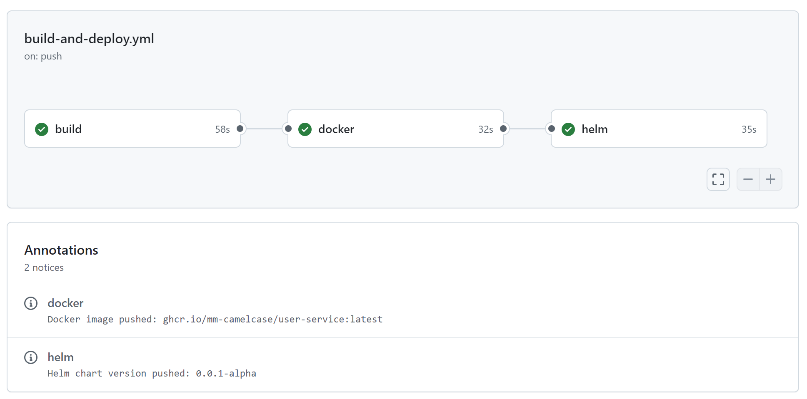

# Demo App

This project is a simple Spring Boot application that can be used for testing CICD pipelines & deployments.

## Requirements

- **Java 17 or above**
- **Gradle** (Optional if using the Gradle wrapper provided in the project)

## Project Structure

This project contains a basic CRUD API with an H2 in-memory database. It can be run locally using the Gradle wrapper (`./gradlew`) provided in the project.

## Common Gradle Commands

Here are some commonly used Gradle commands for managing your Spring Boot project:

``./gradlew bootRun`` - Runs the Spring Boot application. App available at http://localhost:8080   
``./gradlew build`` - Builds the project and packages it into a JAR.  
``./gradlew test`` - Runs the unit tests.  
``./gradlew clean`` - Cleans the project by removing the build directory.  
``./gradlew bootJar`` - Packages the application as an executable JAR.  
``./gradlew dependencies`` - Displays the dependency tree for your project.  
``./gradlew clean build --refresh-dependencies`` - Refresh the Gradle dependencies (usefull for build or dependency issues).  


## CI/CD Pipeline

This project uses a GitHub Actions pipeline to automate building, packaging, and deployment:

1. **Build**: The project is built using Gradle to generate the JAR file.
2. **Docker**: A Docker image is built from the JAR and pushed to the GitHub Container Registry (GHCR).
3. **Helm**: A Helm chart is versioned, packaged, and published to GitHub Packages.




## Helm Integration 

To configure Helm to use GitHub Packages for managing Helm charts:

1. **Create a Personal Access Token (PAT)** with the following permissions:

```bash
read:packages
write:packages
delete:packages
repo (if using private repositories)
```

2. **Authenticate to GitHub Container Registry**: Use the following command to log in to the GitHub Container Registry with your PAT:

```bash
helm registry login ghcr.io --username mm-camelcase --password <your-PAT>
```

3. **Access the Helm Chart**: To view or install the Helm chart from GitHub Packages, use the following command:

```bash
helm show chart oci://ghcr.io/mm-camelcase/helm-charts/user-service --devel
```

This allows you to interact with Helm charts stored in GitHub Packages using Helm commands.


